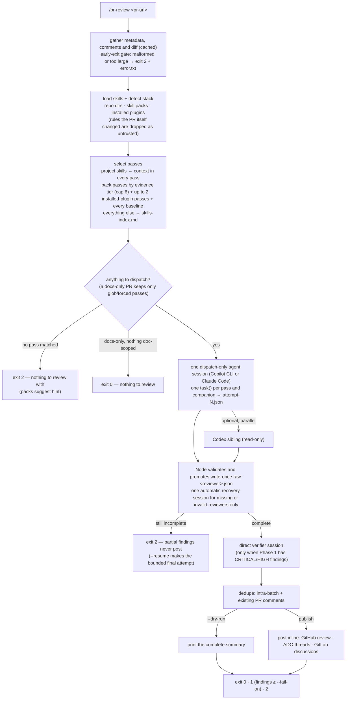

<p align="center">
  
</p>

<h1 align="center">pr-review</h1>

<p align="center"><em>Every finding lands as a resolvable inline thread on the PR — GitHub, Azure DevOps and GitLab, from Copilot CLI or Claude Code.</em></p>

<p align="center">
  <a href="https://github.com/guimatheus92/pr-review/actions/workflows/ci.yml"></a>
  <a href="https://github.com/guimatheus92/pr-review/releases"></a>
  <a href="LICENSE"></a>
  =20" />
</p>

<p align="center">
  
  
</p>

**pr-review** is a plugin for [Copilot CLI](https://docs.github.com/en/copilot/how-tos/copilot-cli/customize-copilot/plugins-creating) **or** Claude Code that reviews a pull request with parallel review passes — each one a skill drawn from synced skill packs or your own repo — inside a single agent session, and posts **every** finding back to the PR as a resolvable inline review comment: never a top-level comment, nothing dropped. A thin Node CLI does the deterministic plumbing (gather, dedupe, post); the agents only review. When the `codex` CLI is installed, a Codex second-opinion reviewer runs alongside automatically (`--no-codex` opts out).

```text
/pr-review https://github.com/org/repo/pull/123
/pr-review https://dev.azure.com/org/proj/_git/repo/pullrequest/456 --dry-run
```

## Highlights

- **Inline-only, nothing dropped.** Findings post as GitHub review comments, Azure DevOps threads or GitLab discussions — never a top-level comment. Lines outside the diff are snapped to it. See [posting guarantees](#posting-guarantees).
- **Passes, not built-in reviewers.** Every pass is one skill applied by a generic agent. Review knowledge lives in versioned [skill packs](#review-passes--skill-packs) (`awesome-copilot`, `owasp`, …) and in your repo's own skill dirs.
- **Your rules in every pass.** Matched `.claude/skills`, `.github/instructions`, `.agents/skills`… files become authoritative project rules for every pass — no cap, never truncated. See [add your own rules](#add-your-own-rules).
- **Stack-aware routing.** GitHub Linguist languages plus manifest dependencies rank passes by evidence tier. Preview the selection with `--context-only`.
- **Untrusted by default.** A rule file the PR itself added or changed cannot instruct its own review; a changed `.pr-review.yaml` or repository MCP config is ignored too.
- **Background-friendly and resumable.** `--detach` returns a run-id, `status` polls it, and `--resume` re-dispatches only what is missing under authenticated run state. Partial findings never post.
- **Two runtimes, one command.** Host the session in Copilot CLI or Claude Code (`--runtime`), same `/pr-review`.
- **Second opinions.** Optional Codex sibling, plus companion plugins (pr-review-toolkit, code-review) when installed.

## How it works



**Why a CLI, not just a skill?** LLMs are unreliable at gathering metadata, deduplicating findings, and posting comments. The Node CLI handles those deterministic tasks; review passes only do the actual reviewing. The orchestrator session is dispatch-only — it cannot assemble findings, decide the verifier, or post. See the [architecture](skills/help/reference/architecture.md) for the full execution model.

Every run reports which skills it used — a progress brief at dispatch (`N pass(es) · M project rule(s) · K on-demand`) and a `## Skills` section in the final summary (with a `**Skipped:** S` segment when any pass was skipped):

```markdown
## Skills
**Passes:** 9 · **Project rules (in every pass):** 2 · **On-demand (index):** 41

| Pass | Matched by |
|---|---|
| awesome-copilot/go | glob |
| owasp/error-handling | baseline |
| … | … |
```

## Table of contents

- [Quick start](#quick-start)
- [Usage](#usage)
- [Posting guarantees](#posting-guarantees)
- [Review passes & skill packs](#review-passes--skill-packs)
- [Add your own rules](#add-your-own-rules)
- [Codex, companions and installed plugins](#codex-companions-and-installed-plugins)
- [Background runs, status and resume](#background-runs-status-and-resume)
- [CLI reference](#cli-reference)
- [CI/CD](#cicd)
- [Documentation](#documentation)
- [Development](#development)
- [Contributing · Security · License](#contributing--security--license)

## Quick start

### 1. Install

Inside a `copilot` session or a `claude` (Claude Code) session — the same two commands in both:

```text
/plugin marketplace add guimatheus92/pr-review
/plugin install pr-review@pr-review
```

No `npm install` needed. The plugin ships a pre-bundled `dist/cli.cjs`; the slash command runs it with `node`.

<details>
<summary><b>How the plugin finds its CLI, and why the manifest lives in two places</b></summary>
<br>

The slash command finds the bundle via `$CLAUDE_PLUGIN_ROOT` under Claude Code (falling back to `~/.copilot/installed-plugins/`) and runs it with `node`. The plugin layout (`commands/`, `skills/`) loads in both hosts; the manifest lives in two places on purpose — `.claude-plugin/plugin.json` (Claude Code's canonical location) and a root `plugin.json` (which Copilot CLI requires).

</details>

<details>
<summary><b>Command name per host, and the bare <code>/pr-review</code> alias under Claude Code</b></summary>
<br>

Copilot CLI exposes the command as `/pr-review`. Claude Code namespaces plugin commands as `/pr-review:pr-review`; since the plugin no longer ships agents, current Claude Code may also register the bare `/pr-review` alias. If your host doesn't, drop a personal command at `~/.claude/commands/pr-review.md` as a fallback (personal commands have no namespace, so `/pr-review` resolves):

````markdown
---
description: Bare alias for the pr-review plugin command.
argument-hint: "<pr-url> [flags]"
allowed-tools: ["Bash"]
---
Run the pr-review CLI in the background and poll it (you are plumbing, not the reviewer):
```bash
CLI=$(find ~/.claude/plugins/cache -name cli.cjs -path '*/pr-review/*/dist/*' -not -path '*/node_modules/*' 2>/dev/null | sort | tail -1)
node "$CLI" review $ARGUMENTS --detach
```
If the output has a `run-id:`, poll `node "$CLI" status <run-id>` (~25s apart) until it prints the summary; otherwise print the output verbatim.
````

</details>

<details>
<summary><b>Install from a local clone</b></summary>
<br>

```bash
git clone https://github.com/guimatheus92/pr-review && cd pr-review
npm install && npm run build
# inside copilot (or claude — same slash commands; claude also accepts `claude plugin marketplace add ./` from the shell):
/plugin marketplace add .
/plugin install pr-review@pr-review
```

</details>

### 2. Authenticate

| Provider | Env var | Fallback |
|---|---|---|
| GitHub | `GITHUB_TOKEN` / `GH_TOKEN` / `COPILOT_GITHUB_TOKEN` | `gh auth token` |
| GitHub Enterprise Server | `GH_ENTERPRISE_TOKEN` / `GITHUB_ENTERPRISE_TOKEN` (github.com tokens are never sent to a GHES host) | `gh auth token --hostname <host>` |
| Azure DevOps | `AZURE_DEVOPS_PAT` / `SYSTEM_ACCESSTOKEN` / `AZURE_DEVOPS_EXT_PAT` (PAT), `AZURE_DEVOPS_BEARER` (bearer) | `az account get-access-token` |
| GitLab | `GITLAB_TOKEN` / `GITLAB_ACCESS_TOKEN` | `glab config get token -h <host>` |

`--detach` resolves the credential in the foreground and injects it into the background child's env, so the CLI/keyring fallbacks never have to run detached — a missing credential fails the launch immediately.

### 3. Review a PR

```text
/pr-review https://github.com/<owner>/<repo>/pull/<number>
```

Posting line comments back to the PR is the default; add `--dry-run` to preview the findings instead.

<details>
<summary><b>Accepted URL shapes and self-hosted hosts</b></summary>
<br>

```text
https://github.com/<owner>/<repo>/pull/<number>
https://<ghes-host>/<owner>/<repo>/pull/<number>                                     # GitHub Enterprise Server
https://dev.azure.com/<org>[/<project>]/_git/<repo>/pullrequest/<id>
https://<org>.visualstudio.com/[<collection>/][<project>/]_git/<repo>/pullrequest/<id>   # legacy ADO
https://<server>/<collection>/<project>/_git/<repo>/pullrequest/<id>                 # Azure DevOps Server (best-effort)
https://gitlab.com/<group>[/<subgroup>]/<project>/-/merge_requests/<iid>
https://<gitlab-host>/<group>/<project>/-/merge_requests/<iid>                       # self-managed GitLab
```

Trailing paths, query strings, and fragments are ignored (`…/pull/42/files?diff=split` works). Self-hosted hosts must be mapped explicitly in the **global** config — a credential is only ever sent to a host you named, so a checkout-local `hosts:` map is ignored (the unrecognized-URL error prints the exact yaml to add):

```yaml
# ~/.pr-review/config.yaml — global only; a hosts: map in .pr-review.yaml is ignored
hosts:
  github.mycorp.com: github
  tfs.corp.com: azuredevops
  git.mycorp.com: gitlab
```

</details>

## Usage

```bash
/pr-review <pr-url>                        # review with auto-discovered skills; posts line comments (default)
/pr-review <pr-url> --dry-run              # preview findings without posting
/pr-review <pr-url> --skip owasp/logging   # skip passes (full pack/skill or bare name; also: verifier, codex)
/pr-review <pr-url> --context-only         # prepare context + the pass files, print stack + pass table, don't dispatch
/pr-review <pr-url> --lang pt-BR           # language for finding titles/bodies (default: en)
/pr-review <pr-url> --fail-on high         # exit 1 if any high/critical finding survives dedupe
/pr-review <pr-url> --runtime claude       # host the session in Claude Code instead of Copilot CLI
/pr-review <pr-url> --no-codex             # skip the Codex second-opinion reviewer
/pr-review <pr-url> --no-companions        # skip installed companion plugins (pr-review-toolkit, code-review)
/pr-review <pr-url> --detach               # run in the background; poll with `pr-review status <run-id>`
```

**Exit codes:** `0` complete with no finding at/above `--fail-on`, `1` findings at/above `--fail-on`, `2` incomplete delivery or another operational failure. Partial findings never post. Without `--fail-on`, retained findings do not change the process status: exit 0 means the pipeline completed, not that the finding count is zero — configure `--fail-on` when the exit code must gate CI.

## Posting guarantees

On a publish run (the default), every finding lands as a resolvable **inline** review thread — so each one can be discussed and resolved in place:

- **Never top-level.** GitHub findings post as review comments (one batched review; if the batch fails, the PR is read back and the missing comments are posted one by one). Azure DevOps findings post as threads; GitLab findings post as inline discussions. There is no top-level issue-comment fallback.
- **Nothing dropped.** Lines outside the diff are snapped to the nearest valid diff line. On GitHub and GitLab, findings that can't anchor where they point (file outside the diff, or no location) are re-anchored to the first valid diff line, keeping the original `file:line` in the comment body. On Azure DevOps, threads are posted at the reported `file:line` as-is (ADO threads are not limited to diff lines), and a finding with no location at all lands as a resolvable PR-level thread; a thread ADO rejects is reported as an error in the summary.
- **Skipping only in `--dry-run`.** A failed write is retried only after the PR has been read back — a failed write is not proof that nothing was written — and anything that still fails is reported as an error in the summary, never silently dropped.

## Review passes & skill packs

There are no built-in reviewer agents. Every review pass is **one skill applied by a generic agent** inside the single orchestrator session, and the skills come from **skill packs** — git repos cloned to `~/.pr-review/packs/<name>/`. Pass names are `<pack>/<skill>` (e.g. `awesome-copilot/go`, `owasp/nodejs-security`); repo skills keep their plain name.

Three packs are pre-configured:

| Pack | Source | Content | Baseline passes (run when nothing better matches) |
|---|---|---|---|
| `awesome-copilot` | `github/awesome-copilot` | `instructions/*.instructions.md`, `skills/*/SKILL.md` | `code-review-generic`, `security-and-owasp`, `performance-optimization`, `qa-engineering-best-practices`, `self-explanatory-code-commenting` |
| `owasp` | `OWASP/CheatSheetSeries` | `cheatsheets/*.md` | `error-handling`, `logging` |
| `anthropic-cybersecurity` | `mukul975/Anthropic-Cybersecurity-Skills` | defensive-review skills (operational/offensive ones excluded) | none — `mode: index`, on-demand only, never a pass |

How passes are selected:

- **Your skills are context, not lenses.** Every matched repo/configured/explicit/forced skill is injected into EVERY pass as authoritative project rules. The passes are pack skills.
- **Evidence tiers.** Pack passes rank by: specific path glob › manifest-backed dependency/framework token › language-consistent type/manifest glob › exact stack tag. At most 6 stack passes run, plus up to 2 installed-plugin passes, plus EVERY baseline pointer. A product guide cannot qualify merely because the PR touches its language or a generic manifest.
- **Stack detection** emits canonical Linguist language names, reads shallow root manifests plus the manifests owning changed files, and keeps language, ecosystem, dependency-name and dependency-token evidence separate. Legacy and canonical Azure DevOps remotes normalize to the same checkout identity.
- **Docs-only PRs** run only glob-matched or `--force-skill` passes. A code PR that matches zero passes exits 2 with a `packs suggest` hint.

Manage packs from the CLI:

```bash
pr-review packs list                      # on-disk state, skill counts, commit, freshness
pr-review packs sync                      # clone/pull every pack + refresh the Linguist cache
pr-review packs add <owner/repo|url>      # add a pack to the global config and clone it
pr-review packs suggest <tags...|pr-url>  # search skills.sh by stack tags — suggest-only, never installs
```

The first review on a machine clones any missing packs automatically (needs `git` and network; failures are warnings, not errors; expect ~1–2 minutes once). Packs more than 30 days out of sync trigger a warning on every review — run `packs sync`.

Configure packs with the `skill_packs:` yaml key. Unlike every other list key (which appends across config levels), `skill_packs` **replaces** the whole list: `skill_packs: []` disables packs entirely, and a list in a repo `.pr-review.yaml` overrides the global list. Entries are `owner/repo` shorthand or `{git, name?, ref?, include?, exclude?, mode?, baseline?}` (`mode: index` = on-demand only). See [configuration](skills/help/reference/configuration.md).

**Security note:** packs are third-party prompt content read by agents with tool access. Pin `ref:` for reproducibility, and know the only install paths are `packs add` and editing `skill_packs` — `packs suggest` never installs anything.

Skip any pass with `--skip <names>` (full `awesome-copilot/go` or bare `go`; also `verifier`, `codex`). The **verifier** remains a pipeline step: dispatched as a generic agent to reconcile across passes when phase 1 produces a CRITICAL/HIGH finding.

## Add your own rules

Review rules live where your agent tools already keep skills — no separate folder, no duplication, no flags:

```text
your-repo/
└── .claude/                           # or .copilot/, .github/, .agents/
    └── skills/
        ├── our-auth-conventions.md    # injected into every pass when relevant
        └── team-style-guide.md
```

- **Every match injects into every pass** as an authoritative project rule (`skills-project.md` — it overrides generic judgement), keeping its plain name. There is no numeric cap and skill bodies are inlined whole, never truncated.
- **Discovered from** `.claude/skills`, `.claude/rules`, `.copilot/skills`, `.github/skills`, `.github/instructions`, and `.agents/skills`. `applies_to`, `applyTo`, and Claude's `paths` are equivalent scopes. Directories you configure yourself (`--skills-dir`, `extra_skills_dirs`, `PR_REVIEW_SKILLS_DIR`) are selected exactly the same way, and still apply when your cwd is not the PR's repository.
- **Targeted or heuristic.** A targeted skill matches exactly when an in-scope changed file matches; a skill without targeting goes through the `name` + `description` relevance heuristic against the changed file paths and the diff.
- **Unmatched skills are surfaced, not dropped.** They land in `skills-index.md`, an on-demand index every pass can read when relevant.
- **Rule files added or modified by the PR under review are untrusted input.** They are excluded — before same-name dedupe — from both authoritative context and the on-demand index, and the summary names the skipped coverage. This includes in-repo files supplied through `--skill` and files inside a configured directory; `--force-skill` is the explicit trust override. A link the PR added or changed is refused before anything behind it is read (see linked directories below). Unchanged rules from the checkout remain authoritative.
- **Scope vs. force.** `--skill <file>` includes one file while preserving its scope (the file must resolve inside the checkout — a link to an outside file is refused). `--force-skill <file|dir>` is the only bypass: a file, or every rule the loader recognizes under a directory (same walk rules: `README.md` never, SKILL.md-owned subfolders under a `skills` root), is injected whole into every pass — no scope, no trust check — so point it only at rules the PR cannot edit. It is per run and CLI-only on purpose: there is no yaml or env key for forcing, so a committed `.pr-review.yaml` can never pre-authorize branch-authored content. Directories configured through `extra_skills_dirs`, `--skills-dir`, or `PR_REVIEW_SKILLS_DIR` are not forced — they are selected and trust-checked like repo skill dirs.
- **Preview the selection** with `--context-only`: it prints a `## Stack` block and a `## Passes` table (`| Pass | Matched by | Matched on | Source |`, plus the index count) and exits without dispatching.

**Linked directories and `skills/` roots.** Discovery follows a directory link — symlink or NTFS junction — one hop, in every skill dir, so rules shared across repos through a link are read like any other (a link met inside a linked directory is not followed). Trust follows authorship, not location: a link the PR itself added or changed — its path, or any parent of it, is in the diff — is refused before anything behind it is read and named as degraded coverage, and a file that resolves outside the checkout is used only when it is committed and clean in its home git repository (a `SKILL.md` needs its whole directory clean) — the same gate applies to every rule outside the checkout (linked, configured or personal), and a repository git cannot read is skipped, never trusted, because on Windows `git checkout` of a PR branch writes through a junction into the shared folder; an untracked or modified file there is skipped and named, while a directory under no git repository at all is trusted as your local configuration (one stderr note per directory reached through a link). Under any root named `skills/`, a subdirectory is a skill only through its `SKILL.md`: a subdirectory without one is skipped (a warning names it when it holds `.md` files), flat `.md` files at the root are still skills, and a `README.md` is never a skill — loose `.md` rules nest only under `rules/` or `instructions/`.

<details>
<summary><b>Routing details</b></summary>
<br>

Large indexes split into digest-bound shards; every indexed body is materialized inside the isolated run directory, and each entry retains its original source for provenance. With no pack passes at all (e.g. `skill_packs: []`), your skills become the passes themselves — up to 10 as passes, with overflow still injected whole as context. `inject_into` is **deprecated**: it is parsed only to print a warning, then ignored. Untargeted **home** skills (`~/.claude/skills/` and friends) are skipped unless supplied through a configured directory (`--skills-dir`, selected like repo skills) or injected whole with `--force-skill <dir>`.

</details>

See [review passes vs skills](skills/help/reference/reviewers-vs-skills.md) and [managing skills & packs](skills/help/reference/adding-your-own-md.md) for the full authoring guide.

## Codex, companions and installed plugins

When the `codex` CLI is installed, an optional `codex` second-opinion reviewer runs as a read-only sibling process in parallel with the agent session. Each attempt writes strict `Finding[]` JSON under `codex-attempts/`, and the attempt is reserved in authenticated state before launch, so a parent-process crash can reuse completed output without silently dropping or rerunning it. Opt out with `--no-codex`, `invoke_codex: false`, `PR_REVIEW_NO_CODEX=1`, or `--skip codex`.

Installed [companion plugins](skills/help/reference/companion-plugins.md) (pr-review-toolkit, code-review) are dispatched inside the same session when present; `--no-companions` or `invoke_companions: false` opts out.

<details>
<summary><b>Installed plugins as a capability source, and the MCP inventory</b></summary>
<br>

Installed plugins — from Copilot CLI or Claude Code alike — provide an additional generic capability source. The CLI reads their manifests, namespaces their skills as `<plugin>/<skill>`, and can select up to two review-oriented plugin passes from exact repository identity, plugin/path identity, or direct `appliesTo` evidence. It inventories MCP server names from trusted repository config, user config, and plugin manifests in `capabilities.json`; repository MCP config is ignored when it changed in the PR, when the checkout is not the PR repository, or when a server would launch code from the reviewed checkout itself. Review runtimes disable ambient, built-in, and inventoried MCP servers so a pass cannot bypass the CLI's posting boundary; capability sidecars report them as unavailable, and a pass that names one anyway is flagged as degraded coverage — an unverified claim, since a denial leak and a fabricated report are indistinguishable from the artifact alone. Declared skill paths and symlinks cannot escape an installed plugin's root.

</details>

## Background runs, status and resume

A full review takes roughly 6–10 minutes. `pr-review review <url> --detach` returns a run-id immediately; `pr-review status <run-id>` shows the live progress feed, or the summary once done. `status` exits `0` when done, `20` while running, `21` when authenticated recovery is available (it prints the exact `--resume` command), `22` on a terminal failure, and `1` when the run-id is unknown.

<details>
<summary><b>Delivery, recovery and resume in detail</b></summary>
<br>

Each task call carries the runtime-required `description` and writes exact `Finding[]` JSON to `reviewer-attempts/<reviewer>/attempt-N.json`. Node validates and promotes it to a collision-resistant, write-once `raw-<reviewer>.json`; the LLM orchestrator only dispatches tasks and never aggregates results. If the initial session delivers only part of the planned set, Node preserves every valid sidecar and runs one automatic recovery session containing only missing/invalid reviewers. A still-incomplete run exits 2 and `--resume <run-id>` gets the bounded final targeted attempt. Partial findings are diagnostic evidence only: they are never deduped or posted.

After complete Phase 1 delivery, Node writes `phase1-findings.json`, decides whether HIGH/CRITICAL findings require reconciliation, runs the verifier as a separate direct session, and writes `single-session-findings.json`. The run plan, attempts, artifact hashes, verifier/Codex state, execution mode, and posting marker are mirrored in the run directory (`~/.pr-review/runs/<id>/`) and authenticated under `~/.pr-review/control/`. `status` reports counts such as `reviewers 18/22 · 14 findings · 4 missing` and prints `--dry-run` in the recovery command for a dry-run run. A complete dry run can be promoted to publishing — resume it without `--dry-run` and the previewed findings post; an incomplete one is refused (`incomplete-promotion`), and publish can never be demoted to dry-run. Previews and benign no-dispatch runs do not create recovery control. Legacy consolidated runs retain replay support; legacy Phase 1 is dry-run diagnostic evidence only.

</details>

## CLI reference

<details>
<summary><b>All commands and flags</b></summary>
<br>

```bash
pr-review review <pr-url> [flags]            # full pipeline
#   --dry-run               preview findings without posting (posting is the default)
#   --context-only          prepare pr-context.md + the pass files,
#                           print the stack + pass table, exit
#   --skip <names>          comma-separated pass names to skip (full pack/skill
#                           or bare skill name; also: verifier, codex)
#   --lang <code>           output language for findings (yaml: language, env: PR_REVIEW_LANG)
#   --fail-on <severity>    critical|high|medium|low|nit → exit 1 on surviving findings
#   --runtime <name>        copilot|claude|auto — which agent CLI hosts the session
#                           (yaml: runtime, env: PR_REVIEW_RUNTIME; default auto)
#   --no-codex              skip the Codex second-opinion reviewer
#   --no-companions         skip installed companion plugins for this run
#   --detach                start in the background, print a run-id, return immediately
#   --resume <run-id>       reuse complete authenticated output, or make the
#                           final targeted attempt for incomplete coverage
#   --force-post            re-post even if this run already recorded a successful post
#   --skill <file...>       include files while respecting applyTo/paths
#   --force-skill <file|dir...>
#                           include files, or every .md under a directory, whole:
#                           no applyTo/paths scope, no rule-trust check (CLI only)
#   --skills-dir <path...>  include a directory of skill .md files (selected like a repo skill dir)
#   --plugin-dir <path...>  include a packaged plugin directory (has plugin.yaml)
#   --no-autodiscover       don't scan the standard skill dirs (repo + home)
#   --dedupe-mode <mode>    strict|loose|off (default strict)
#   --no-cache              bypass the gather cache
#   --copilot <path>        path to the copilot binary (implies --runtime copilot unless --runtime given)
#   --from-gather <path>    (eval harness) read the gather JSON from a file
#                           instead of the provider APIs; requires --dry-run
pr-review status <run-id>                    # live progress, summary, or the recovery command (exit 0/20/21/22; 1 = unknown run-id)
pr-review gather <pr-url> [--out <path>]     # fetch + cache metadata only
pr-review post <pr-url> --findings <path>    # post pre-computed findings
pr-review packs list|sync|add <source>|suggest <tags...|pr-url>   # manage skill packs
pr-review init [--with-config] [--force]     # scaffold a starter team-rules skill + optional .pr-review.yaml
pr-review configure [path] [--force]         # write ~/.pr-review/config.yaml
pr-review doctor                             # environment preflight: runtimes, codex, companions, auth, skill packs
pr-review plugins list                       # list repo skills + pack skill counts
pr-review plugins doctor                     # check companion plugin status
pr-review config show                        # print merged config + sources
pr-review cache info | clear                 # manage local cache
```

</details>

## CI/CD

Add `--fail-on <severity>` when the exit code gates a merge; treat exit 2 as an infrastructure failure, not a review verdict. Ready-made GitHub Actions and Azure DevOps Pipelines examples live in [CI integration](skills/help/reference/ci-integration.md).

## Documentation

All documentation lives under the single `help` skill (`skills/help/`), loaded by Copilot CLI and Claude Code alike — one `/pr-review:help` palette entry whose `SKILL.md` indexes the per-topic reference files. Ask any pr-review question and the `help` skill surfaces the right one.

| Topic | Doc |
|---|---|
| Quickstart | [skills/help/reference/pr-review-usage.md](skills/help/reference/pr-review-usage.md) |
| Architecture & source map | [skills/help/reference/architecture.md](skills/help/reference/architecture.md) |
| Configuration (5-level merge, YAML, env vars) | [skills/help/reference/configuration.md](skills/help/reference/configuration.md) |
| Review passes vs skills (authoring, routing) | [skills/help/reference/reviewers-vs-skills.md](skills/help/reference/reviewers-vs-skills.md) |
| Adding your own skills & packs | [skills/help/reference/adding-your-own-md.md](skills/help/reference/adding-your-own-md.md) |
| Companion plugins (pr-review-toolkit, code-review) | [skills/help/reference/companion-plugins.md](skills/help/reference/companion-plugins.md) |
| CI/CD (GitHub Actions, ADO Pipelines) | [skills/help/reference/ci-integration.md](skills/help/reference/ci-integration.md) |
| Caching | [skills/help/reference/caching.md](skills/help/reference/caching.md) |
| Performance optimizations | [skills/help/reference/performance.md](skills/help/reference/performance.md) |
| Changelog | [CHANGELOG.md](CHANGELOG.md) |
| Contributing & plugin authoring | [CONTRIBUTING.md](CONTRIBUTING.md) |
| Security policy | [SECURITY.md](SECURITY.md) |

## Development

```bash
git clone https://github.com/guimatheus92/pr-review && cd pr-review
npm install
npm run build          # tsc + esbuild → dist/cli.cjs
npm run test           # node --test over tests/**/*.test.ts
```

<details>
<summary><b>Dogfood a local branch (no PR needed)</b></summary>
<br>

Maintainers can review the current branch without opening a remote PR:

```bash
npm run build
npm run dogfood -- --base origin/main --include-untracked  # include new, non-ignored files
```

The command supports `github.com` origins, derives the current fork identity from `origin`, and gathers committed, staged, and unstaged changes. Untracked files require `--include-untracked`; even with opt-in, secret-bearing names and high-confidence credential content are refused before any gather or prompt artifact is written. Tracked diff hunks, including persisted context lines, are checked for high-confidence credentials too; for renames it validates both the old and new path, and the generated `dist/cli.cjs` content is excluded only after both names pass that check. Artifacts live only under `~/.pr-review/runs/`, and the CLI always receives `--dry-run`. It refuses a missing/stale bundle, so run `npm run build` first. Add `--context-only` while tuning routing. Companion plugins are disabled because URL-based companion commands cannot consume a synthetic local PR safely; exercise them against a real PR dry-run. Generated and binary artifacts remain recorded but are excluded from LLM context with an explicit reason.

</details>

## Contributing · Security · License

Contributions are welcome — see [CONTRIBUTING.md](CONTRIBUTING.md). Report vulnerabilities privately as described in [SECURITY.md](SECURITY.md). Everyone interacting here is expected to follow the [code of conduct](CODE_OF_CONDUCT.md).

MIT — see [LICENSE](LICENSE).
